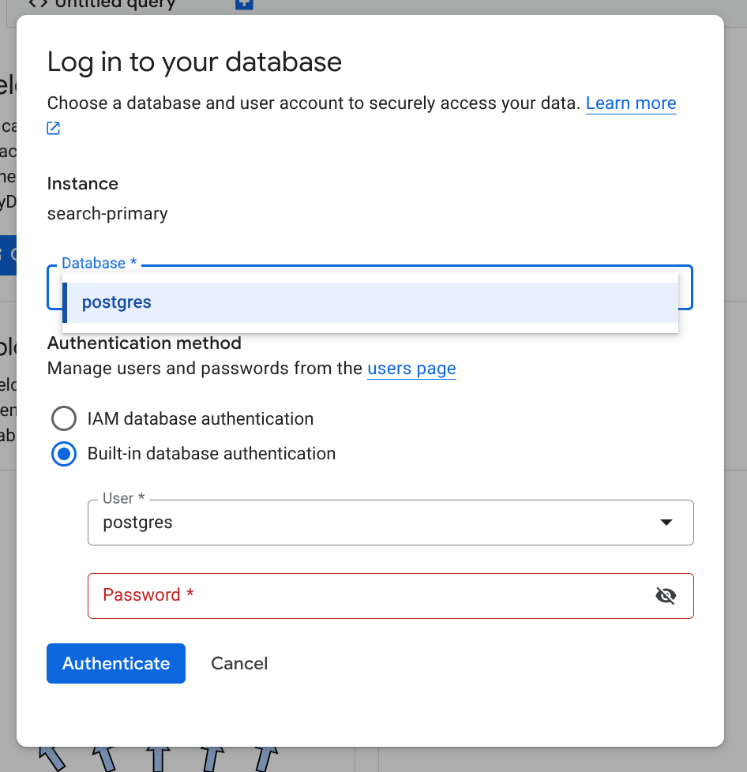
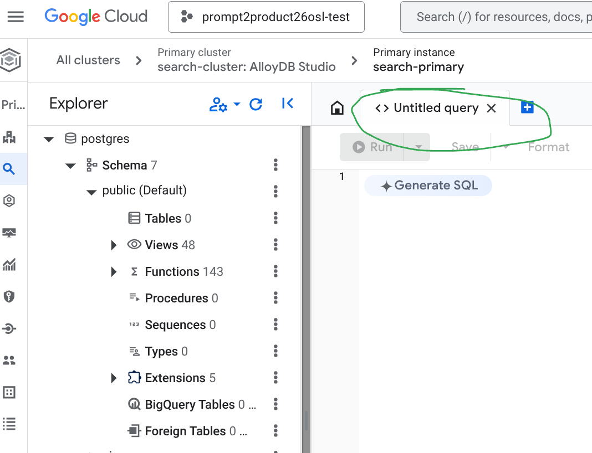

## Lab 3: Database Setup

In this section we will:

- run some scripts for setting up AlloyDB
- run a Python script to generate images and embeddings for property listings.

### Insert the data to AlloyDB

Navigate to [AlloyDB in the Cloud Console](https://console.cloud.google.com/alloydb/clusters). You should see a list of resources, with your `search-cluster` listed, and `search-primary` as the primary instance. Click on `search-primary`.

Click the magnifying glass icon on the left-hand activity bar to open AlloyDB Studio. You should be presented with a login dialogue



`postgres` should be the only available database and user name available. Use your configured database password to log in. You should now see the editor. Tap the "Untitled Query" tab (pictured).



1. Copy & paste the contents of the <walkthrough-editor-open-file filePath="content/pr2pr/alloydb-artefacts/alloydb_setup.sql">alloydb_setup.sql</walkthrough-editor-open-file> file into the editor and click the "Run" button.
2. Open a new editor tab. Copy & paste the contents of the <walkthrough-editor-open-file filePath="content/pr2pr/alloydb-artefacts/100 _sample records.sql">100 _sample records.sql</walkthrough-editor-open-file> file into the editor and click the "Run" button.


### Generate Images and Embeddings

Now we will generate images and embeddings for property listings. We will use a Python script to:

1. Generate images using Vertex AI Imagen.
2. Upload them to Google Cloud Storage.
3. Calculate Visual Embeddings.
4. Update the database rows with the image URI and image_vector.


#### Prerequisites

1. **Environment Variables**:
The script loads environment variables from `../backend/.env`.
Ensure this file exists and is populated. You can generate it using Terraform outputs:

```bash
cd ~/bootkon/content/pr2pr/terraform/
./generate_env.sh
```

You can inspect and edit <walkthrough-editor-open-file filePath="content/pr2pr/backend/.env">the generated `.env` file</walkthrough-editor-open-file>.

Or manually create it based on `../example.env`. The /setup_env.sh script also helps you setting up all required environment variables.

2. **AlloyDB Auth Proxy**:
The Python script will connect to AlloyDB via proxy through `127.0.0.1:5432`. We will run an the Auth Proxy script which will connect to AlloyDB via the Bastion host.

Run the following script:
```bash
cd ~/bootkon/content/pr2pr/alloydb-artefacts/
./run_proxy.sh
```

This script will stay running in the terminal. Leave it open while you execute the next steps (you can interrupte it if needed with `Ctrl+C`).

3. **Python Environment**:

Open a second terminal in your editor while the proxy is running.

First we ensure we have Python installed with the required dependencies.
We'll use Virtual Environment.

```bash
cd ~/bootkon/content/pr2pr/alloydb-artefacts/
python3 -m venv venv
source venv/bin/activate
pip install -r requirements.txt
```

#### Running the Script

With the proxy (from step 2) still running:

```bash
python bootstrap_images.py
```

What it does:
1.  Connects to AlloyDB via localhost:5432.
2.  Finds listings with `image_gcs_uri IS NULL`.
3.  Generates an image using Vertex AI Imagen.
4.  Uploads the image to the GCS bucket (`property-images-{PROJECT_ID}`).
5.  Generates a multimodal embedding for the image.
6.  Updates the `property_listings` table with the GCS URI and embedding.

This will take a few minutes. Once it completes, you can close the 2nd terminal window (the one which ran this Python script), switch back to the first terminal window, and interrupt the proxy script with `Ctrl+C`.

### Create Indexes

In Cloud Console's AlloyDB Studio, run the following SQL statement to verify that the table has been populated:

```sql
SELECT count(*) as property_count FROM "search".property_listings;
```

The result should be about 118.

Copy and paste the contents of the <walkthrough-editor-open-file filePath="content/pr2pr/alloydb-artefacts/alloydb_indexes.sql">alloydb_indexes.sql</walkthrough-editor-open-file> file into an editor tab, and click the "Run" button.

### Setup Natural Language Interface


Finally, copy & paste the contents of the <walkthrough-editor-open-file filePath="content/pr2pr/alloydb-artefacts/alloydb_ai_nl_setup.sql">alloydb_ai_nl_setup.sql</walkthrough-editor-open-file> file into the editor and click the "Run" button.